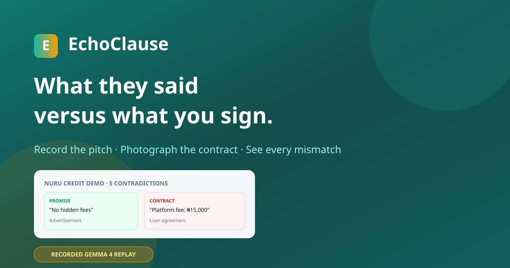

# EchoClause — What They Said vs. What You Sign

Evidence-grounded promise-to-contract reconciliation powered by **Gemma 4** multimodal extraction and deterministic financial calculators.

[](https://www.kaggle.com/competitions/gemma-hackathon)

## Hero

Borrowers sign loan contracts after seeing ads, hearing sales pitches, and chatting with support — but the fine print often contradicts what they were told. **EchoClause** ingests multimodal evidence (images, audio, chat screenshots), extracts structured financial claims with Gemma 4, normalizes terms deterministically, and surfaces contradictions *before* signing.

> **Record the pitch. Photograph the contract. See every mismatch before you sign.**

**Live demo:** [docs/index.html](docs/index.html) — interactive static replay with evidence gallery, claim cards, and expandable conflict matrix (GitHub Pages ready).

**Demo case:** fictional **Nuru Credit** US micro-loan ($1,000 principal) — 5 contradictions across platform fee, total repayment, late fee, term days, and automatic debit.

## What the demo actually shows (multimodal honesty)

| Capability | Designed | Live verified in repo | Shown in demo / video / pages |
|------------|----------|----------------------|------------------------------|
| Image OCR / claim extraction | Yes — `extract_claims_from_image` | **No** — R1 spike artifacts are `NOT_RUN_GPU` (P100 sm_60 / load failures); no `"status": "PASSED"` artifact | Static replay + video use **recorded** claims; notebook runs live path when GPU load succeeds |
| Native audio extraction | Yes — `extract_claims_from_audio` | **No** — same spike blockers; synthetic tone WAV may not yield rich audio claims | Sales pitch claims come from `recorded_claims.json` or ASR transcript fallback |
| Function calling | Yes — allowlisted tools + `run_function_call_demo` | **Partial** — deterministic tool validation passes without model; live FC unverified locally | Writeup/notebook describe FC; demo reconciliation uses deterministic calculators |
| Recorded replay | Yes — `recorded_claims.json` | **Yes** — pytest + GitHub Pages + video | Labeled *"Interactive replay generated from a recorded Gemma 4 run"* |

Live Gemma multimodal inference is implemented in code and exercised on Kaggle T4 when model mount + GPU succeed. Public demo surfaces use **frozen recorded output**, not fabricated live generations.



## Architecture

```
Evidence (PNG/WAV) → Gemma 4 claim extraction → Deterministic normalization
    → Reconciliation (promise vs contract) → Evidence-grounded conflict report
```

| Layer | Component | Role |
|-------|-----------|------|
| 1 | Source ingestion | Advertisement, sales audio, support chat, contract |
| 2 | Gemma 4 runtime | Multimodal JSON claim extraction + function calling |
| 3 | Normalization | `normalize_financial_term` (deterministic) |
| 4 | Calculators | Fee %, total repayment, term comparison |
| 5 | Reconciliation | Promise vs contract → `ComparisonResult` |
| 6 | Report | Conflicts + clarification questions + provenance |

## Quick start (local)

```bash
cd echo-clause-gemma4
python -m venv .venv
.venv\Scripts\activate        # Windows
pip install -e ".[dev,gemma,ui]"
python scripts/generate_demo_assets.py
python -m pytest -q
python scripts/run_demo_pipeline.py --use-recorded   # offline replay
python scripts/build_static_demo.py
python app.py                                        # Gradio UI on :7860
```

### Live Gemma inference (GPU required)

```bash
python scripts/run_runtime_spike.py      # R1 multimodal + function-calling gate
python scripts/run_demo_pipeline.py      # full pipeline with live extraction
```

On Windows without CUDA/HF access, run on **Kaggle T4** (see below).

## Kaggle reproduction

1. Accept Gemma 4 license on Hugging Face; add `HF_TOKEN` to Kaggle Secrets.
2. Push kernel: `python scripts/kaggle_push.py` (requires `~/.kaggle/kaggle.json`).
3. Open notebook **EchoClause Gemma 4 Demo**, enable **GPU T4**, Run All.
4. Expected: R1 spike passes; pipeline detects **5/5** gold contradictions.

## Model strategy

| Priority | Model | Notes |
|----------|-------|-------|
| 1 | `google/gemma-4-E4B-it` | bf16_auto, then bnb_4bit (max 2 attempts) |
| 2 | `google/gemma-4-E2B-it` | Public reproducible fallback |
| Audio | Gemma native WAV | ASR transcript fallback disclosed if needed |

No cloud APIs, fine-tuning, RAG, or model weights in git.

## Project layout

```
echo-clause-gemma4/
├── echo_clause/          # Core library (schemas, runtime, pipeline)
├── assets/demo_case/     # Synthetic Nuru Credit evidence + gold.json
├── scripts/              # Spike, pipeline, static demo, Kaggle push
├── notebooks/            # Kaggle demo notebook + kernel metadata
├── docs/                 # Static replay demo (GitHub Pages)
│   ├── index.html        # Dashboard UI
│   ├── app.js + styles.css
│   ├── data/demo.json    # Recorded pipeline output
│   └── artifacts/        # Architecture diagram, OG preview
├── app.py                # Gradio UI
└── submission/WRITEUP.md # Hackathon writeup
```

## Test results

```bash
python -m pytest -q
# 36 passed — schemas, calculators, normalization, tools, demo case, pipeline
```

## Disclaimer

EchoClause compares representations across supplied evidence. It does not provide legal advice or determine legal enforceability.

## License

MIT
